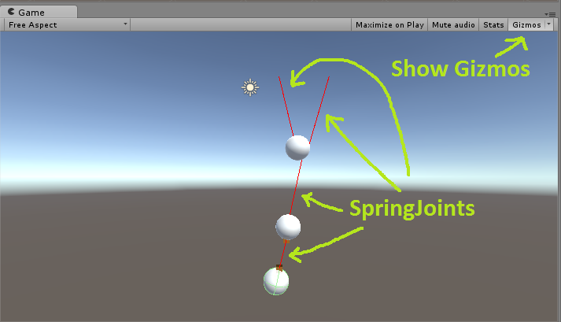

# JabaUnityScripts
Helper scripts for Unity development

## JADebugDrawPhysics
Location: Scripts/DebugDraw/JADebugDrawPhysics.cs

Put this on a GameObject with a Rigidbody, and it will draw the body's velocity vector and estimated acceleration vector. The acceleration is estimated because Unity does not give direct access to read back the forces or accelerations on a Rigidbody. So, we take the difference in velocity over the previous two FixedUpdate steps, and divide that by the timestep. (Hmm. there's probably a divide-by-zero error in there if you pause time using Time.timeScale). It uses Debug.DrawRay(...), so to see the vectors in the Game window, you'll need to enable Gizmos.

## JADebugDrawSpringJoints
Location: Scripts/DebugDraw/JADebugDrawSpringJoints.cs

This script is useful for debugging Unity's SpringJoints. Unity will draw the spring's anchors, but not a line connecting the ends. When you put this script on a GameObject, it will draw a coloured line for each SpringJoint also attached to that object. The colour of the line shows whether that spring is stretched, compressed, or neutral.

You can set the stretched, compressed, or neutral colours to whatever you want.
NOTE: you need to enable show gizmos (button in top-right of Game view) if you want to see the springs in the Game window, not just in the Scene window.

## JADebugDrawCollisions
Location: Scripts/DebugDraw/JADebugDrawCollisions.cs

This script will draw all contact normals at all contact points for the given object. You can use this to debug collision problems. The colour and scale of the lines used to draw the normals is customizable. Make sure to enable Gizmos if you want to see the output in the Game window, not just the Scene window.

## JAShaderUtils
Location: Scripts/JAShaderUtils.cs

    public static void SetMaterialRenderingMode(Material material, StandardShaderRenderingMode mode);

Unity's Standard Shader (the default when you create a new Material) provides several rendering modes. There's a drop-down list in the material editor GUI to switch the rendering mode, but it's not as easy to do programmatically. Here's how you can do it from code. This is useful if, for example you're creating procedural materials in code.

This is a modified version of some code from the Unity forums, here: http://forum.unity3d.com/threads/standard-material-shader-ignoring-setfloat-property-_mode.344557/

# JABooleanSignal
Location: Scripts/JABooleanSignal.cs

There are often times where you'll want to be able to tell whether some true/false condition changed from false to true or from true to false. Typically, you end up adding pairs of variables for the present and previous values of the condition. JABooleanSignal just wraps this so you can add one field of type JABooleanSignal, instead of two separate bools.

For example:
    
    private BooleanSignal isAirborne;
    
    //...

    void Update()
    {
        isAirborne.Append( CheckWhetherInTheAir() );
        // Did we just go airborne this update?
        if (isAirborne.RisingEdge)
        {
            // Do stuff for takeoff ...
        }
        else if (isAirborne.FallingEdge)
        {
            // Do stuff for landing ...
        }
    }

#### JABooleanSignal TODO
* Make this generic, so it works for ints, floats, etc.
* Add ability to fire events to listeners on state changes
 
